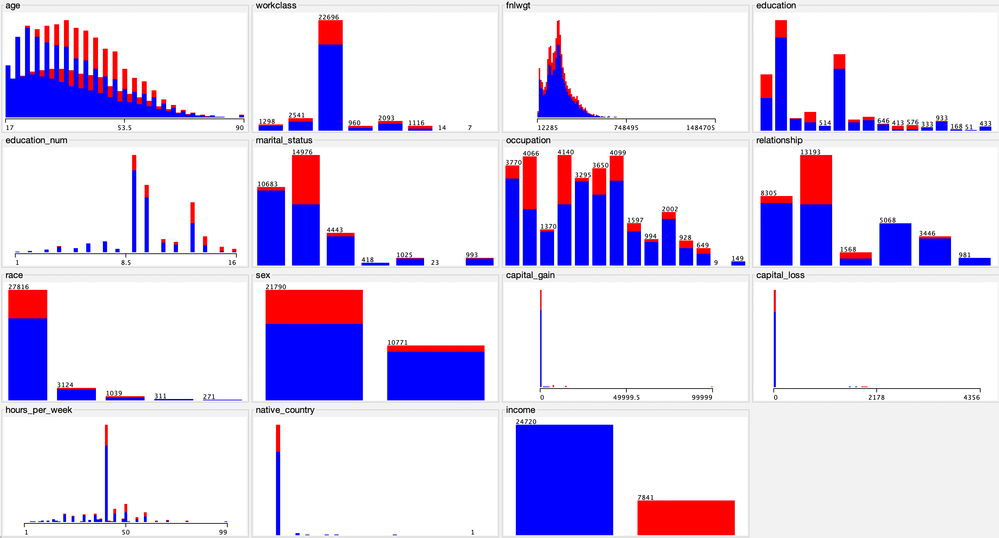

# Naive_Bayesian_Classifier
Mini project 1 during my first semester at SFSU in data mining class
<br>

## How to use it ?
1. python3 classifier.py (default mode)
2. --discretize, --no-discretize:
  a. discretize numeric values using equal bins (default: True)
3. --use_mode, --no-use_mode
  a. use mode or mean to fill NaN data (default: True)

## Example
```sh
python3 classifier.py
```

## Input Format
The adult.csv dataset is used

## Data analysis
I used [Weka](https://www.cs.waikato.ac.nz/ml/weka/index.html) software to analyse the dataset.


## Step of working
At the beginning, i started to work on data analysis using matplotlib on jupyter notebook but it wasn’t efficient so i used weka.<br>
To start this project I had to understand what is naive bayes. So I started my research and started an algorithm without success. I discovered that to make machine learning I had to work on the data before doing anything.<br>
I created a function to clean the data and split the dataset. After that I tried to restart the naive bayes algo and get a result. Then I added next features like flags and what was wrong.<br>
Finally I created the k fold cross validation function.

## About the result
My results are not too bad for this first project.
I obtained 0.73 for the best accuracy score. I can upgrade the algorithm to better fit and train the model. I can also upgrade the rapidity of execution.
